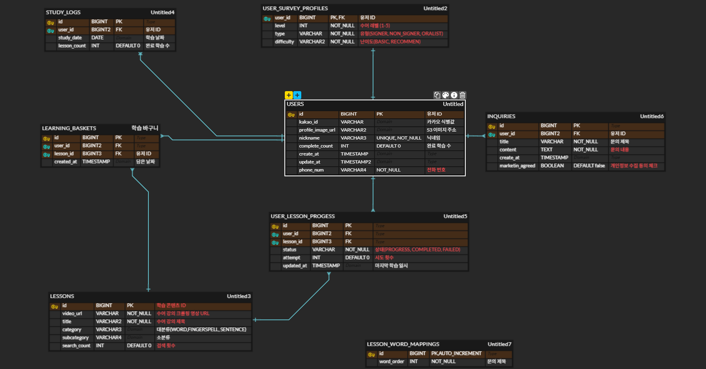

# 🗄️ 데이터베이스 스키마



## 개요
MySQL 기반 관계형 데이터베이스 스키마입니다.

## 테이블 목록

1. **users** - 사용자 계정
2. **lessons** - 학습 레슨
3. **words** - 학습 단어
4. **sentences** - 학습 문장
5. **user_lesson_progress** - 사용자 학습 진도
6. **user_survey_profiles** - 사용자 설문 프로필
7. **learning_baskets** - 사용자 학습 바구니
8. **study_logs** - 학습 활동 기록
9. **search_histories** - 검색 히스토리
10. **profile_photos** - 프로필 사진
11. **inquiries** - 1:1 문의
12. **lesson_word_mappings** - 레슨-단어 매핑

## 상세 테이블 스키마

### 1. users (사용자)

```sql
CREATE TABLE users (
    id INT PRIMARY KEY AUTO_INCREMENT,
    kakao_id VARCHAR(255) UNIQUE,
    email VARCHAR(50),
    nickname VARCHAR(50),
    phone_num VARCHAR(20),
    profile_image_url VARCHAR(255),
    kakao_access_token LONGTEXT,
    kakao_refresh_token LONGTEXT,
    kakao_notification_enabled BOOLEAN DEFAULT FALSE,
    complete_count INT DEFAULT 0,
    created_at DATETIME DEFAULT CURRENT_TIMESTAMP,
    updated_at DATETIME DEFAULT CURRENT_TIMESTAMP ON UPDATE CURRENT_TIMESTAMP,
    nickname_updated_at DATETIME NULL,
    
    INDEX idx_kakao_id (kakao_id),
    INDEX idx_email (email),
    INDEX idx_created_at (created_at)
) ENGINE=InnoDB DEFAULT CHARSET=utf8mb4 COLLATE=utf8mb4_unicode_ci;
```

**주요 필드**:
- `kakao_id`: Kakao OAuth 고유 ID
- `email`: 사용자 이메일 (Optional)
- `nickname`: 사용자 닉네임 (Optional)
- `phone_num`: 연락처 (Optional)
- `profile_image_url`: 프로필 사진 URL
- `complete_count`: 완료한 레슨 수
- `kakao_notification_enabled`: 카톡 알림 활성화 여부

---

### 2. lessons (레슨)

```sql
CREATE TABLE lessons (
    id INT PRIMARY KEY AUTO_INCREMENT,
    title VARCHAR(100) NOT NULL,
    description TEXT,
    type ENUM('fingerspell', 'word', 'sentence') DEFAULT 'word',
    difficulty_level ENUM('beginner', 'intermediate', 'advanced') DEFAULT 'beginner',
    category VARCHAR(50),
    thumbnail_url VARCHAR(255),
    video_url VARCHAR(255),
    created_at DATETIME DEFAULT CURRENT_TIMESTAMP,
    updated_at DATETIME DEFAULT CURRENT_TIMESTAMP ON UPDATE CURRENT_TIMESTAMP,
    
    INDEX idx_type (type),
    INDEX idx_difficulty_level (difficulty_level),
    INDEX idx_category (category)
) ENGINE=InnoDB DEFAULT CHARSET=utf8mb4 COLLATE=utf8mb4_unicode_ci;
```

**주요 필드**:
- `type`: 레슨 타입 (손가락 문자, 단어, 문장)
- `difficulty_level`: 난이도
- `category`: 카테고리 (일상, 음식, 동물 등)
- `thumbnail_url`: 썸네일
- `video_url`: 시범 영상

**샘플 데이터**:
```
- A~Z 손가락 문자 (Fingerspell, Beginner)
- 일상용어 (Word, Beginner)
- 음식 이름 (Word, Beginner)
- 동물 이름 (Word, Intermediate)
- 인사말 (Sentence, Beginner)
```

---

### 3. words (단어)

```sql
CREATE TABLE words (
    id INT PRIMARY KEY AUTO_INCREMENT,
    word VARCHAR(100) NOT NULL UNIQUE,
    hangul_word VARCHAR(100) NOT NULL,
    meaning TEXT,
    category VARCHAR(50),
    video_url VARCHAR(255),
    image_url VARCHAR(255),
    difficulty_level ENUM('beginner', 'intermediate', 'advanced') DEFAULT 'beginner',
    pronunciation VARCHAR(100),
    example_sentence TEXT,
    created_at DATETIME DEFAULT CURRENT_TIMESTAMP,
    updated_at DATETIME DEFAULT CURRENT_TIMESTAMP ON UPDATE CURRENT_TIMESTAMP,
    
    UNIQUE KEY uk_hangul_word (hangul_word),
    INDEX idx_category (category),
    INDEX idx_difficulty_level (difficulty_level)
) ENGINE=InnoDB DEFAULT CHARSET=utf8mb4 COLLATE=utf8mb4_unicode_ci;
```

**주요 필드**:
- `word`: 영문 단어
- `hangul_word`: 한글 단어
- `meaning`: 뜻 설명
- `video_url`: 수어 시범 영상
- `example_sentence`: 예문

---

### 4. sentences (문장)

```sql
CREATE TABLE sentences (
    id INT PRIMARY KEY AUTO_INCREMENT,
    korean_text VARCHAR(200) NOT NULL,
    english_text VARCHAR(200),
    meaning TEXT,
    video_url VARCHAR(255),
    difficulty_level ENUM('beginner', 'intermediate', 'advanced') DEFAULT 'beginner',
    category VARCHAR(50),
    created_at DATETIME DEFAULT CURRENT_TIMESTAMP,
    updated_at DATETIME DEFAULT CURRENT_TIMESTAMP ON UPDATE CURRENT_TIMESTAMP,
    
    INDEX idx_difficulty_level (difficulty_level),
    INDEX idx_category (category)
) ENGINE=InnoDB DEFAULT CHARSET=utf8mb4 COLLATE=utf8mb4_unicode_ci;
```

**주요 필드**:
- `korean_text`: 한글 문장
- `english_text`: 영문 문장
- `video_url`: 수어 시범 영상

---

### 5. user_lesson_progress (사용자 학습 진도)

```sql
CREATE TABLE user_lesson_progress (
    id INT PRIMARY KEY AUTO_INCREMENT,
    user_id INT NOT NULL,
    lesson_id INT NOT NULL,
    progress INT DEFAULT 0,
    current_word_index INT DEFAULT 0,
    status ENUM('not_started', 'in_progress', 'completed') DEFAULT 'not_started',
    completed_at DATETIME NULL,
    accuracy FLOAT DEFAULT 0,
    total_duration INT DEFAULT 0,
    last_accessed_at DATETIME,
    created_at DATETIME DEFAULT CURRENT_TIMESTAMP,
    updated_at DATETIME DEFAULT CURRENT_TIMESTAMP ON UPDATE CURRENT_TIMESTAMP,
    
    FOREIGN KEY (user_id) REFERENCES users(id) ON DELETE CASCADE,
    FOREIGN KEY (lesson_id) REFERENCES lessons(id) ON DELETE CASCADE,
    UNIQUE KEY uk_user_lesson (user_id, lesson_id),
    INDEX idx_status (status),
    INDEX idx_user_id (user_id),
    INDEX idx_completed_at (completed_at)
) ENGINE=InnoDB DEFAULT CHARSET=utf8mb4 COLLATE=utf8mb4_unicode_ci;
```

**주요 필드**:
- `progress`: 진행률 (0-100%)
- `status`: 학습 상태 (미시작, 진행 중, 완료)
- `accuracy`: 정확도
- `total_duration`: 소요 시간

---

### 6. user_survey_profiles (사용자 설문 프로필)

```sql
CREATE TABLE user_survey_profiles (
    id INT PRIMARY KEY AUTO_INCREMENT,
    user_id INT NOT NULL UNIQUE,
    learning_goal VARCHAR(100),
    preferred_difficulty ENUM('beginner', 'intermediate', 'advanced') DEFAULT 'beginner',
    daily_study_time INT DEFAULT 30,
    preferred_category VARCHAR(100),
    pace ENUM('slow', 'normal', 'fast') DEFAULT 'normal',
    notifications_enabled BOOLEAN DEFAULT TRUE,
    survey_completed_at DATETIME,
    created_at DATETIME DEFAULT CURRENT_TIMESTAMP,
    updated_at DATETIME DEFAULT CURRENT_TIMESTAMP ON UPDATE CURRENT_TIMESTAMP,
    
    FOREIGN KEY (user_id) REFERENCES users(id) ON DELETE CASCADE,
    INDEX idx_user_id (user_id)
) ENGINE=InnoDB DEFAULT CHARSET=utf8mb4 COLLATE=utf8mb4_unicode_ci;
```

**주요 필드**:
- `learning_goal`: 학습 목표
- `preferred_difficulty`: 선호 난이도
- `daily_study_time`: 일일 학습 시간 (분)
- `preferred_category`: 선호 카테고리

---

### 7. learning_baskets (학습 바구니 - 즐겨찾기)

```sql
CREATE TABLE learning_baskets (
    id INT PRIMARY KEY AUTO_INCREMENT,
    user_id INT NOT NULL,
    lesson_id INT NULL,
    word_id INT NULL,
    sentence_id INT NULL,
    type ENUM('lesson', 'word', 'sentence') NOT NULL,
    created_at DATETIME DEFAULT CURRENT_TIMESTAMP,
    
    FOREIGN KEY (user_id) REFERENCES users(id) ON DELETE CASCADE,
    FOREIGN KEY (lesson_id) REFERENCES lessons(id) ON DELETE CASCADE,
    FOREIGN KEY (word_id) REFERENCES words(id) ON DELETE CASCADE,
    FOREIGN KEY (sentence_id) REFERENCES sentences(id) ON DELETE CASCADE,
    INDEX idx_user_id (user_id),
    INDEX idx_type (type),
    INDEX idx_created_at (created_at)
) ENGINE=InnoDB DEFAULT CHARSET=utf8mb4 COLLATE=utf8mb4_unicode_ci;
```

**주요 필드**:
- `type`: 바구니 항목 타입 (레슨, 단어, 문장)
- 해당 타입에 맞는 ID만 NOT NULL

---

### 8. study_logs (학습 활동 기록)

```sql
CREATE TABLE study_logs (
    id INT PRIMARY KEY AUTO_INCREMENT,
    user_id INT NOT NULL,
    lesson_id INT NOT NULL,
    word_id INT NULL,
    sentence_id INT NULL,
    start_time DATETIME NOT NULL,
    end_time DATETIME NOT NULL,
    duration INT NOT NULL,
    accuracy FLOAT DEFAULT 0,
    attempts INT DEFAULT 1,
    status ENUM('completed', 'abandoned') DEFAULT 'completed',
    created_at DATETIME DEFAULT CURRENT_TIMESTAMP,
    
    FOREIGN KEY (user_id) REFERENCES users(id) ON DELETE CASCADE,
    FOREIGN KEY (lesson_id) REFERENCES lessons(id) ON DELETE CASCADE,
    FOREIGN KEY (word_id) REFERENCES words(id) ON DELETE SET NULL,
    FOREIGN KEY (sentence_id) REFERENCES sentences(id) ON DELETE SET NULL,
    INDEX idx_user_id (user_id),
    INDEX idx_start_time (start_time),
    INDEX idx_created_at (created_at)
) ENGINE=InnoDB DEFAULT CHARSET=utf8mb4 COLLATE=utf8mb4_unicode_ci;
```

**주요 필드**:
- `duration`: 학습 소요 시간
- `accuracy`: 정확도
- `attempts`: 시도 횟수
- `status`: 학습 상태 (완료, 중단)

---

### 9. search_histories (검색 히스토리)

```sql
CREATE TABLE search_histories (
    id INT PRIMARY KEY AUTO_INCREMENT,
    user_id INT NOT NULL,
    query VARCHAR(100) NOT NULL,
    result_count INT DEFAULT 0,
    searched_at DATETIME DEFAULT CURRENT_TIMESTAMP,
    
    FOREIGN KEY (user_id) REFERENCES users(id) ON DELETE CASCADE,
    INDEX idx_user_id (user_id),
    INDEX idx_searched_at (searched_at),
    INDEX idx_query (query)
) ENGINE=InnoDB DEFAULT CHARSET=utf8mb4 COLLATE=utf8mb4_unicode_ci;
```

**주요 필드**:
- `query`: 검색어
- `result_count`: 검색 결과 수

---

### 10. profile_photos (프로필 사진)

```sql
CREATE TABLE profile_photos (
    id INT PRIMARY KEY AUTO_INCREMENT,
    user_id INT NOT NULL UNIQUE,
    image_url VARCHAR(255) NOT NULL,
    original_filename VARCHAR(255),
    file_size INT,
    uploaded_at DATETIME DEFAULT CURRENT_TIMESTAMP,
    
    FOREIGN KEY (user_id) REFERENCES users(id) ON DELETE CASCADE,
    INDEX idx_user_id (user_id)
) ENGINE=InnoDB DEFAULT CHARSET=utf8mb4 COLLATE=utf8mb4_unicode_ci;
```

**주요 필드**:
- `image_url`: 저장된 이미지 URL
- `file_size`: 파일 크기 (바이트)

---

### 11. inquiries (1:1 문의)

```sql
CREATE TABLE inquiries (
    id INT PRIMARY KEY AUTO_INCREMENT,
    user_id INT NOT NULL,
    title VARCHAR(100) NOT NULL,
    content TEXT NOT NULL,
    category VARCHAR(50),
    status ENUM('pending', 'in_progress', 'resolved') DEFAULT 'pending',
    response TEXT NULL,
    responded_at DATETIME NULL,
    created_at DATETIME DEFAULT CURRENT_TIMESTAMP,
    updated_at DATETIME DEFAULT CURRENT_TIMESTAMP ON UPDATE CURRENT_TIMESTAMP,
    
    FOREIGN KEY (user_id) REFERENCES users(id) ON DELETE CASCADE,
    INDEX idx_user_id (user_id),
    INDEX idx_status (status),
    INDEX idx_created_at (created_at)
) ENGINE=InnoDB DEFAULT CHARSET=utf8mb4 COLLATE=utf8mb4_unicode_ci;
```

**주요 필드**:
- `status`: 문의 상태 (대기, 처리 중, 해결)
- `response`: 관리자 답변

---

### 12. lesson_word_mappings (레슨-단어 매핑)

```sql
CREATE TABLE lesson_word_mappings (
    id INT PRIMARY KEY AUTO_INCREMENT,
    lesson_id INT NOT NULL,
    word_id INT NOT NULL,
    sequence INT DEFAULT 0,
    created_at DATETIME DEFAULT CURRENT_TIMESTAMP,
    
    FOREIGN KEY (lesson_id) REFERENCES lessons(id) ON DELETE CASCADE,
    FOREIGN KEY (word_id) REFERENCES words(id) ON DELETE CASCADE,
    UNIQUE KEY uk_lesson_word (lesson_id, word_id),
    INDEX idx_lesson_id (lesson_id),
    INDEX idx_sequence (sequence)
) ENGINE=InnoDB DEFAULT CHARSET=utf8mb4 COLLATE=utf8mb4_unicode_ci;
```

**주요 필드**:
- `sequence`: 레슨 내에서의 단어 순서

---

## 데이터 관계도 (ER Diagram)

```
┌─────────────────────┐
│      users          │
├─────────────────────┤
│ id (PK)             │
│ kakao_id (UNIQUE)   │
│ email               │
│ nickname            │
│ phone_num           │
│ profile_image_url   │
│ created_at          │
└──────────┬──────────┘
           │
    ┌──────┴──────────────┬──────────────────┬──────────────────┐
    │                     │                  │                  │
    ▼                     ▼                  ▼                  ▼
┌─────────────────┐ ┌──────────────────┐ ┌────────────────┐ ┌──────────────────┐
│  user_lesson_   │ │user_survey_      │ │learning_       │ │study_logs        │
│  progress       │ │profiles          │ │baskets         │ │                  │
├─────────────────┤ ├──────────────────┤ ├────────────────┤ ├──────────────────┤
│ user_id (FK)    │ │ user_id (FK)     │ │ user_id (FK)   │ │ user_id (FK)     │
│ lesson_id (FK)  │ │ learning_goal    │ │ lesson_id (FK) │ │ lesson_id (FK)   │
│ progress (%)    │ │ preferred_diff   │ │ word_id (FK)   │ │ accuracy (%)     │
│ accuracy (%)    │ │ daily_study_time │ │ sentence_id    │ │ duration (sec)   │
│ status          │ │ preferred_cat    │ │ type           │ │ start_time       │
└────────┬────────┘ └──────────────────┘ └────────┬───────┘ │ end_time         │
         │                                        │          └──────────────────┘
         │                                        │
         └────────────────┬───────────────────────┘
                          │
                          ▼
                  ┌────────────────────┐
                  │    lessons         │
                  ├────────────────────┤
                  │ id (PK)            │
                  │ title              │
                  │ type (enum)        │
                  │ difficulty_level   │
                  │ category           │
                  │ video_url          │
                  └────────┬───────────┘
                           │
                           ▼
                  ┌────────────────────────────┐
                  │ lesson_word_mappings       │
                  ├────────────────────────────┤
                  │ lesson_id (FK)             │
                  │ word_id (FK)               │
                  │ sequence                   │
                  └────────┬───────────────────┘
                           │
                           ▼
                  ┌─────────────────────┐
                  │      words          │
                  ├─────────────────────┤
                  │ id (PK)             │
                  │ word (UNIQUE)       │
                  │ hangul_word         │
                  │ meaning             │
                  │ video_url           │
                  │ difficulty_level    │
                  │ category            │
                  └─────────────────────┘
```
