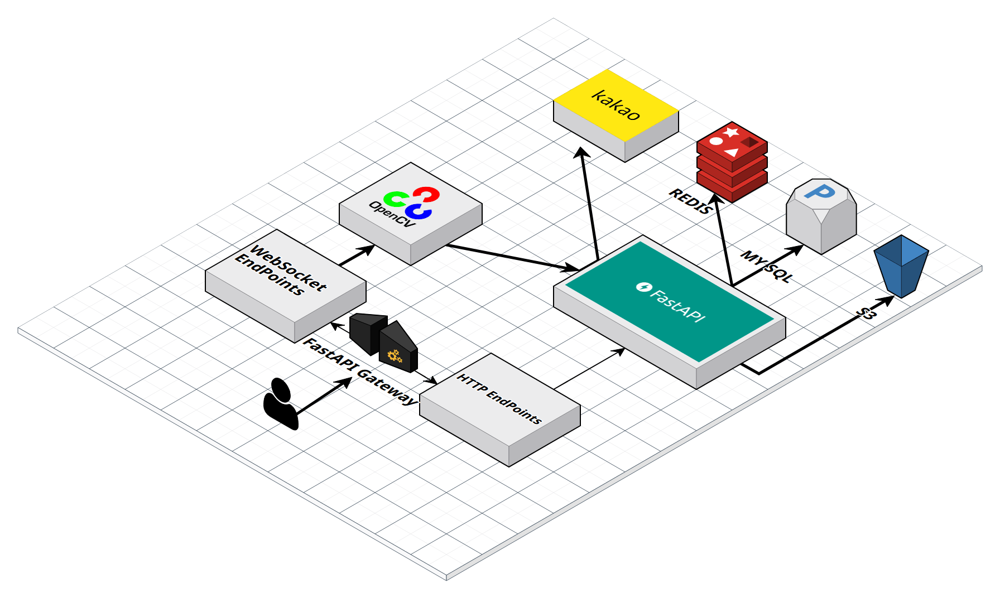

# 🏗️ 서비스 아키텍처



## 개요
실시간 수어 번역 서비스 백엔드는 **FastAPI 기반의 마이크로 서비스 아키텍처**로 설계되었습니다.

## 시스템 아키텍처 다이어그램

```
┌─────────────────────────────────────────────────────────────┐
│                     Frontend (React/Vue)                    │
│          - HTML/CSS/JS 정적 파일 서빙                         │
│          - WebSocket 실시간 통신                              │
└──────────────────────┬──────────────────────────────────────┘
                       │
                       ▼
┌─────────────────────────────────────────────────────────────┐
│                   FastAPI Application                       │
├─────────────────────────────────────────────────────────────┤
│  CORS Middleware │ 요청 검증 │ 인증 처리 │ 에러 핸들링           │
└─────────────────────────────────────────────────────────────┘
                       │
        ┌──────────────┼──────────────┐
        ▼              ▼              ▼
┌──────────────┐ ┌──────────────┐ ┌──────────────┐
│  Auth Layer  │ │  API Layer   │ │  ML Layer    │
│              │ │              │ │              │
│- JWT Token   │ │- Users       │ │- Fingerspell│
│- Kakao OAuth │ │- Learning    │ │- Word Model │
│- Security    │ │- Survey      │ │- Video Model│
│              │ │- Profile     │ │- Inference  │
│              │ │- Search      │ │              │
└──────────────┘ └──────────────┘ └──────────────┘
        │              │              │
        └──────────────┼──────────────┘
                       ▼
        ┌──────────────────────────────┐
        │  Domain Layer (Business      │
        │  Logic & Repositories)       │
        │  - Entity                    │
        │  - Repository                │
        │  - Service/UseCase           │
        │  - DTO                       │
        └──────────────────────────────┘
                       │
        ┌──────────────┼──────────────┐
        ▼              ▼              ▼
┌──────────────┐ ┌──────────────┐ ┌──────────────┐
│   MySQL DB   │ │  Redis Cache │ │   Storage    │
│              │ │              │ │              │
│- Relational │ │- Session Mgmt │ │- Profile Pic │
│  Data       │ │- Caching     │ │- Video Frames│
│             │ │              │ │- Model Dump  │
└──────────────┘ └──────────────┘ └──────────────┘
```

## 계층별 설명

### 1. **프레젠테이션 계층** (Frontend)
- **역할**: 사용자 인터페이스 제공
- **구성**: HTML, CSS, JavaScript
- **기능**:
  - 사용자 인증 UI
  - 실시간 수어 인식 화면
  - 학습 대시보드
  - 개인정보 관리

### 2. **API 게이트웨이 계층** (FastAPI)
- **역할**: 모든 요청의 진입점, 라우팅 및 미들웨어 처리
- **구성**: `main/main.py`
- **책임**:
  - CORS 미들웨어 (Cross-Origin 요청 허용)
  - 정적 파일 서빙 (CSS, JS, 이미지)
  - 애플리케이션 생명주기 관리 (lifespan)
  - 라우터 통합

### 3. **인증 계층** (Auth Layer)
- **위치**: `main/core/security.py`, `main/domain/user/`
- **기능**:
  - **JWT 토큰 기반 인증**: 모든 보호된 엔드포인트 검증
  - **Kakao OAuth 로그인**: 소셜 로그인 통합
  - **비밀번호 해싱**: bcrypt를 통한 안전한 암호화
  - **토큰 만료 처리**: 자동 갱신 메커니즘

### 4. **API 계층** (Router Layer)
위치: `main/api/`

#### 4.1 사용자 관리 (`user_routes.py`)
```
POST   /api/v1/users/register        → 회원가입
POST   /api/v1/auth/login            → 카카오 로그인
GET    /api/v1/users/me              → 현재 사용자 정보
PUT    /api/v1/users/{user_id}       → 사용자 정보 수정
DELETE /api/v1/users/{user_id}       → 회원탈퇴
```

#### 4.2 학습 관리 (`learning_routes.py`)
```
GET    /api/v1/learning/lessons      → 레슨 목록 조회
GET    /api/v1/learning/lesson/{id}  → 단일 레슨 조회
POST   /api/v1/learning/progress     → 학습 진도 저장
GET    /api/v1/learning/basket       → 학습 바구니 조회
POST   /api/v1/learning/basket       → 학습 바구니 추가
```

#### 4.3 설문 조사 (`survey_routes.py`)
```
POST   /api/v1/users/{user_id}/survey    → 설문 응답 저장
GET    /api/v1/users/{user_id}/survey    → 사용자 설문 프로필
```

#### 4.4 프로필 관리 (`profile_routes.py`)
```
GET    /api/v1/profile/{user_id}        → 프로필 조회
POST   /api/v1/profile/photo            → 프로필 사진 업로드
```

#### 4.5 검색 (`search_routes.py`)
```
GET    /api/v1/search?q=keyword         → 수어 검색
GET    /api/v1/search/history           → 검색 히스토리
```

### 5. **비즈니스 로직 계층** (Domain Layer)
위치: `main/domain/`

클린 아키텍처 원칙을 따름:

```
Domain Structure:
{entity}
  ├── __init__.py
  ├── dto/                      # Data Transfer Object
  │   └── {entity}_dto.py
  ├── entity/                   # Domain Model
  │   └── {entity}.py
  ├── repository/               # Data Access Layer
  │   └── {entity}_repository.py
  ├── service/                  # Business Logic
  │   └── {entity}_service.py
  └── usecase/                  # Use Cases
      └── {entity}_usecase.py
```

#### 주요 도메인:
- **User**: 사용자 계정 관리
- **Learning**: 레슨, 단어, 문장 학습
- **LearningBasket**: 학습 바구니 (즐겨찾기)
- **UserSurveyProfiles**: 사용자 선호도 프로필
- **UserLessonProgress**: 학습 진도 추적
- **StudyLog**: 학습 활동 기록
- **Search**: 검색 히스토리
- **ProfilePhoto**: 프로필 사진 관리
- **Inquiry**: 1:1 문의

### 6. **머신러닝 모델 계층** (ML Layer)
위치: `main/learning_model/`

```
learning_model/
├── model_fingerspell.pt       # 손가락 문자 인식 모델
├── model_word.pt              # 단어 수어 인식 모델
├── model_video.pt             # 비디오 기반 인식 모델
├── recon_fingerspell.py       # 손가락 문자 추론
├── recon_word.py              # 단어 추론
└── recon_video.py             # 비디오 추론
```

**사용 기술**:
- **PyTorch**: 딥러닝 모델 로딩 및 실행
- **MediaPipe**: 손 포즈 추정
- **OpenCV**: 이미지/비디오 처리

### 7. **데이터 계층** (Data Layer)
- **주 데이터베이스**: MySQL
  - 사용자 정보
  - 학습 진도
  - 레슨 및 단어 데이터
  
- **캐시**: Redis
  - 세션 관리
  - 자주 접근하는 데이터 캐싱
  - 실시간 데이터 저장

### 8. **인프라 & 지원 서비스**
위치: `main/core/`

| 모듈 | 역할 |
|------|------|
| `config.py` | 환경변수 관리 (Pydantic) |
| `database.py` | 데이터베이스 연결 설정 |
| `redis_client.py` | Redis 클라이언트 |
| `security.py` | JWT, 암호화 처리 |
| `scheduler.py` | 백그라운드 작업 (APScheduler) |
| `email_notification.py` | 이메일 알림 |
| `kakao_notification.py` | Kakao 카톡 알림 |

## 주요 기술 스택

| 계층 | 기술 |
|------|------|
| **웹 프레임워크** | FastAPI, Uvicorn |
| **ORM** | SQLModel (Pydantic + SQLAlchemy) |
| **데이터베이스** | MySQL, Redis |
| **인증** | JWT, Kakao OAuth |
| **ML/CV** | PyTorch, MediaPipe, OpenCV |
| **보안** | bcrypt, cryptography |
| **로깅** | Loguru |
| **스케줄링** | APScheduler |

## 데이터 흐름

### 1. 사용자 등록 흐름
```
Frontend (회원가입 폼)
    ↓
POST /api/v1/users/register (UserDto)
    ↓
user_routes.register()
    ↓
UserUseCase.register_user()
    ↓
UserRepository.create_user()
    ↓
MySQL (INSERT users)
    ↓
JWT Token 반환
    ↓
Frontend (로그인 상태 저장)
```

### 2. 실시간 수어 인식 흐름
```
Frontend (웹캠 입력)
    ↓
WebSocket Connection
    ↓
learning_routes (비디오 프레임 수신)
    ↓
recon_video.py (모델 추론)
    ↓
MediaPipe (손 포즈 추출)
    ↓
PyTorch Model (분류)
    ↓
결과 전송
    ↓
Frontend (인식 결과 표시)
```

### 3. 학습 진도 저장 흐름
```
Frontend (단어 학습 완료)
    ↓
POST /api/v1/learning/progress (ProgressDto)
    ↓
learning_routes.save_progress()
    ↓
LearningUseCase.update_progress()
    ↓
UserLessonProgressRepository.update()
    ↓
MySQL (UPDATE user_lesson_progress)
    ↓
StudyLogRepository.create() (학습 기록 생성)
    ↓
SUCCESS
```

## 보안 아키텍처

### 인증 흐름
```
1. 사용자가 Kakao 로그인 버튼 클릭
   ↓
2. Kakao Authorization Code 획득
   ↓
3. POST /api/v1/auth/login (code)
   ↓
4. Backend → Kakao API (Token 교환)
   ↓
5. Kakao User Info 획득
   ↓
6. User 데이터베이스 조회/생성
   ↓
7. JWT Token 생성
   ↓
8. Frontend에 JWT 반환
   ↓
9. 이후 모든 요청에 JWT 포함
```

### 토큰 검증
```
Authorization: Bearer {JWT_TOKEN}
    ↓
security.py::verify_token()
    ↓
jwt.decode() with SECRET_KEY
    ↓
토큰 유효성 검증
    ↓
사용자 정보 추출
    ↓
요청 처리 진행
```

## 확장 가능성

- **마이크로서비스 전환**: 각 도메인을 독립적인 서비스로 분리 가능
- **메시지 큐 추가**: 비동기 작업 처리 (RabbitMQ, Kafka)
- **API 게이트웨이**: Kong, AWS API Gateway 도입 가능
- **컨테이너화**: Docker, Kubernetes 배포 지원
- **모니터링**: Prometheus, Grafana 연동 가능
