# 👤 사용자 플로우 (User Flow)

## 1. 전체 사용자 여정 (User Journey)

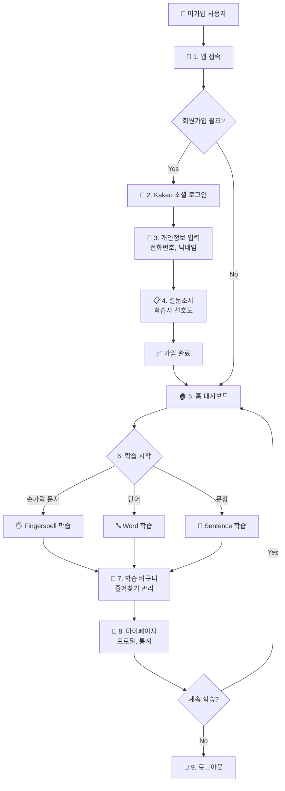

## 2. 상세 플로우별 시나리오

### 시나리오 1: 회원가입 및 초기 설정

```mermaid
graph TD
    A["👤 미가입 사용자가 앱에 접속"] --> B["📱 로그인 페이지"]
    B --> C["🔐 Kakao 로그인 버튼 클릭"]
    C --> D["🔑 Kakao OAuth 인증 페이지<br/>Kakao ID/PW 입력"]
    D --> E["🔌 POST /api/v1/auth/login<br/>authorization_code"]
    E --> F["🔍 Kakao ID 기반 사용자 조회<br/>첫 로그인이면 자동 생성"]
    F --> G["🎫 JWT Token 생성 & 반환<br/>access_token, user_id"]
    G --> H["📝 개인정보 입력 페이지"]
    H --> I["📋 - 전화번호<br/>- 닉네임<br/>- 프로필 사진"]
    I --> J["📤 PUT /api/v1/users/user_id"]
    J --> K["❓ 설문조사 페이지"]
    K --> L["📊 - 학습 목표 선택<br/>- 난이도 선호도<br/>- 학습 시간 설정"]
    L --> M["📤 POST /api/v1/users/user_id/survey"]
    M --> N["✅ 설정 완료<br/>홈 대시보드로 이동"]


### 시나리오 2: 손가락 문자(Fingerspell) 학습

```mermaid
graph TD
    A["🏠 홈 대시보드"] --> B["🖐️ 손가락 문자 학습 선택"]
    B --> C["📋 GET /api/v1/learning/lessons<br/>필터: type=fingerspell"]
    C --> D["📝 Fingerspell 레슨 목록 페이지"]
    D --> E["🎯 특정 레슨 선택<br/>예: A~Z 기초"]
    E --> F["🎥 실시간 인식 페이지"]
    F --> G["📹 - 웹캠 활성화<br/>- MediaPipe 손 추적"]
    G --> H["🔌 WebSocket Connection"]
    H --> I["👐 사용자가 손 모양으로 입력<br/>예: A 손가락 문자 시연"]
    I --> J["⚙️ recon_fingerspell.py"]
    J --> K["🔍 - 프레임 캡처<br/>- MediaPipe 손 포즈 추출<br/>- PyTorch 모델 추론"]
    K --> L["📊 결과 반환<br/>predicted_char, confidence"]
    L --> M["🌐 WebSocket로 실시간 전송"]
    M --> N["📱 Frontend에서 결과 표시"]
    N --> O["✅ - 인식된 문자<br/>- 신뢰도 바<br/>- 정답/오답"]
    O --> P{모든 문자 완료?}
    P -->|No| Q["▶️ 다음 문자"]
    Q --> I
    P -->|Yes| R["💾 POST /api/v1/learning/progress<br/>학습 진도 저장"]
    R --> S["📝 StudyLog 자동 생성<br/>학습 시간, 정확도"]
    S --> T["🎉 완료 축하!"]
    T --> U["📊 학습 통계 페이지"]
    U --> V["🏆 - 정확도 평가<br/>- 소요 시간<br/>- 다음 학습 추천"]
```

### 시나리오 3: 단어(Word) 학습

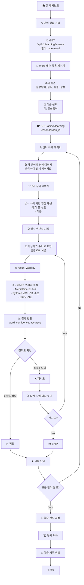

### 시나리오 4: 문장(Sentence) 학습

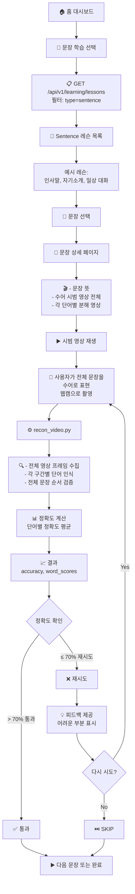

### 시나리오 5: 학습 바구니 (Learning Basket)

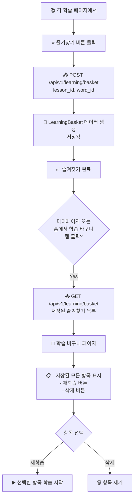

### 시나리오 6: 마이페이지 (My Page)

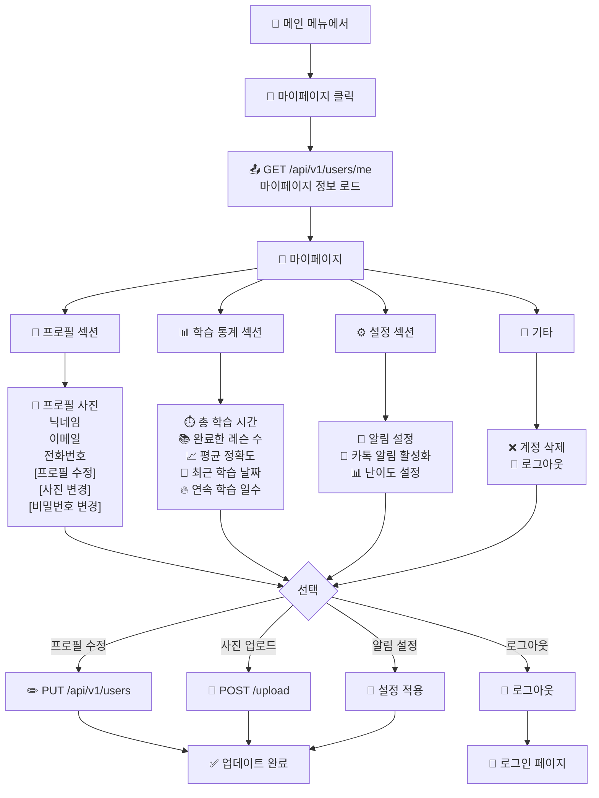

## 3. 검색 및 발견 (Search & Discovery)

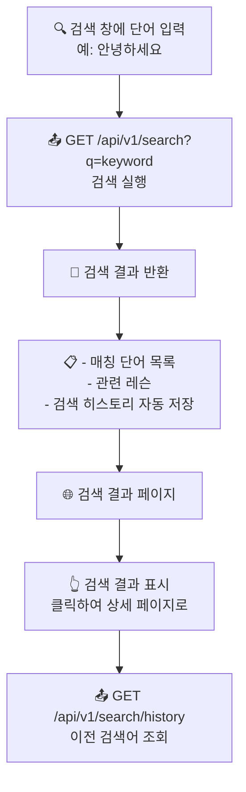

---

## 4. 상태 관리 (State Management)

### 세션 상태
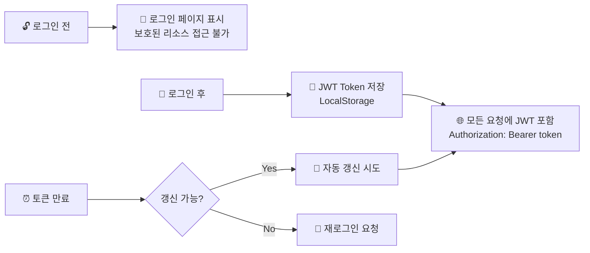

### 학습 진도 상태
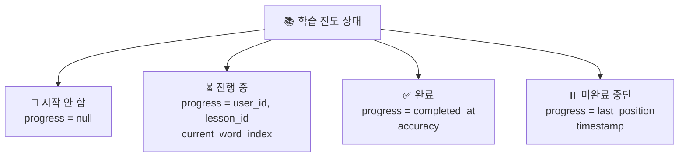

---

## 5. 에러 처리 (Error Handling)

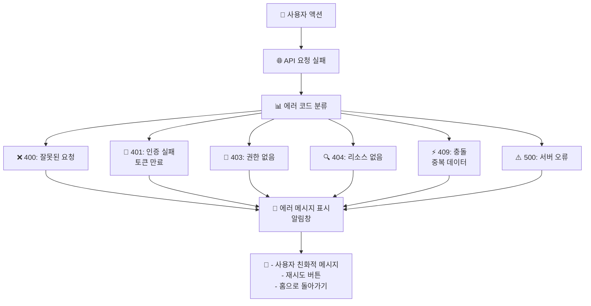

---

## 6. 통지 및 피드백

### 학습 완료 통지
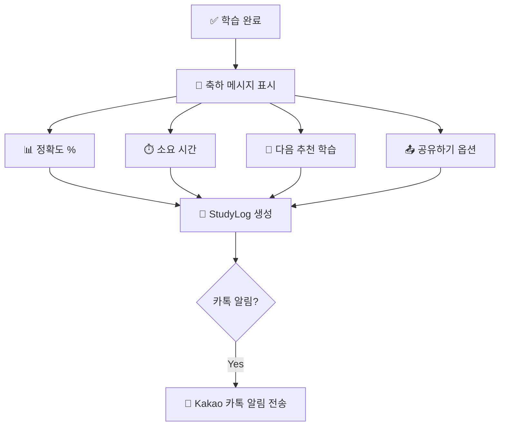

### 목표 달성 알림
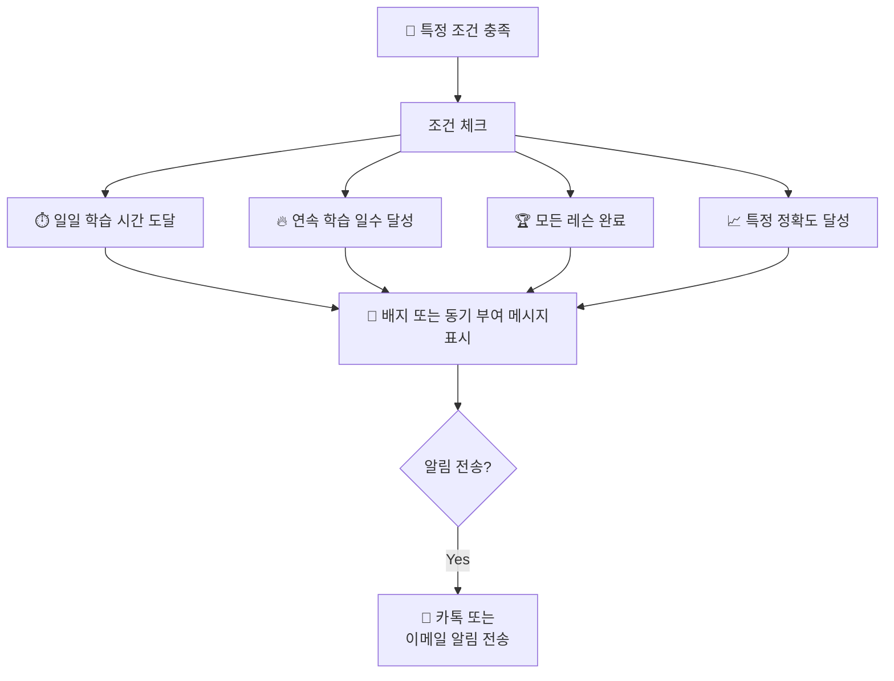

---

## 7. 로그아웃 및 세션 종료

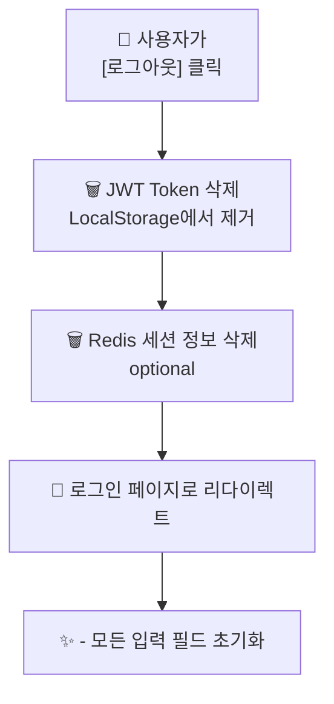

---

## 8. 오프라인 처리 (Offline Handling)

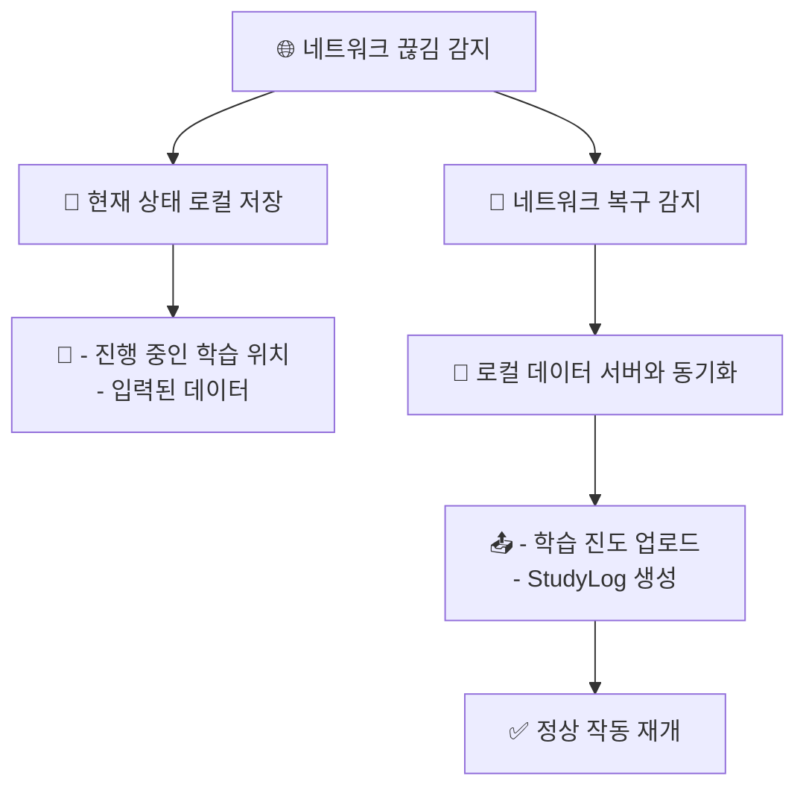
